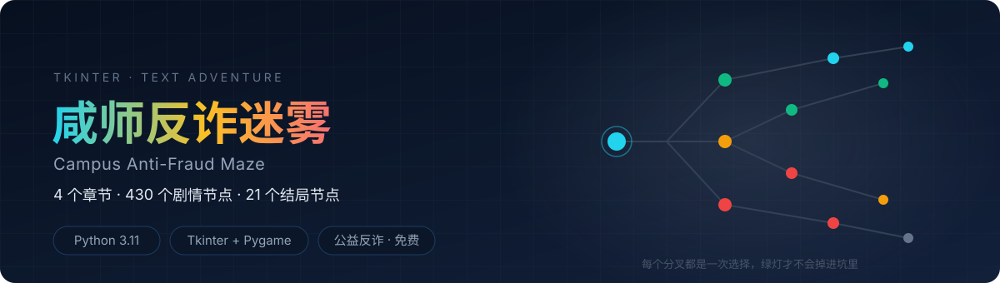
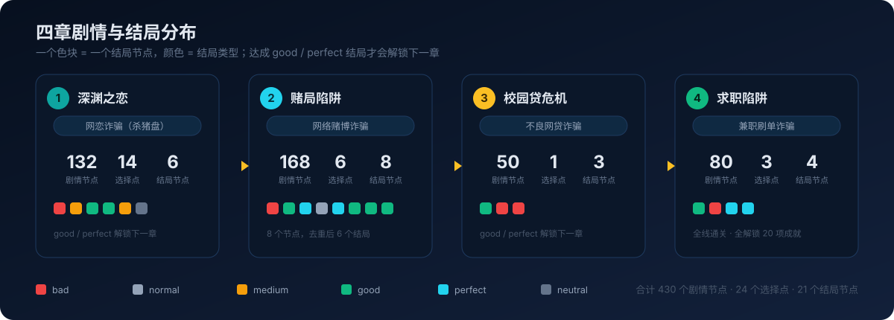

<div align="center">
  

  <h1>Campus Anti-Fraud Maze</h1>

  <p><b>A text adventure about campus scams — 4 chapters, 430 story nodes, 21 ending nodes.</b><br>
  No lecturing. You walk into the trap and find out for yourself.</p>

  <p>
    
    
    
    
    
  </p>

  <p><b>English</b> · <a href="README.md">简体中文</a></p>
</div>

---

## What is this

Anti-fraud awareness campaigns are everywhere, and they usually look like a few slides plus the sentence "stay vigilant". The problem is that nobody remembers a slide deck at the moment they actually get scammed.

**Campus Anti-Fraud Maze** takes a different route: it puts you inside the scam and makes you choose. You play 「小夏」, a university student, through four chapters covering the most common campus scams — romance/romance-investment ("pig butchering"), online gambling, predatory student loans, and part-time job fraud. Each chapter branches heavily; every choice moves your trust, suspicion and money values, and lands you on a different ending.

Endings are tiered: `bad` means you sink completely, `perfect` means you not only avoided the scam but pulled someone else out. **Only `good` / `perfect` endings unlock the next chapter** — which is roughly how reality works too.

> Four hidden clues are buried in the story. Spotting one triggers a cyan particle effect, and the ending screen shows how many you have collected.

## Download and play

Grab **`反诈迷雾.exe`** from [Releases](../../releases/latest) — a single file, about 119 MB, **no Python installation required**. Just double-click it.

On first launch it creates `achievements.json` (achievement progress) and `game_save.json` (save file) next to the executable.

## Run from source

```bash
pip install pillow pygame
python main.py
```

Requires Python 3 with Tkinter from the standard library (included in the official installers).

## The four chapters

| Chapter | Title | Scam type | Story nodes | Choice points | Ending nodes |
|---|---|---|---|---|---|
| 1 | 深渊之恋 (Deep Dive Into Love) | Romance scam / "pig butchering" | 132 | 14 | 6 |
| 2 | 赌局陷阱 (The Gambling Trap) | Online gambling fraud | 168 | 6 | 8 |
| 3 | 校园贷危机 (Student Loan Crisis) | Predatory lending | 50 | 1 | 3 |
| 4 | 求职陷阱 (Job Hunting Trap) | Part-time job / task fraud | 80 | 3 | 4 |
| **Total** | | | **430** | **24** | **21** |



## Endings

### Chapter 1 — 深渊之恋

| Ending | Type |
|---|---|
| 彻底沉沦 | bad |
| 半醒半梦 | medium |
| 老师出手 | good |
| 报警成功 | good |
| 火车站对峙 | medium |
| 及时清醒 | neutral |

### Chapter 2 — 赌局陷阱

| Ending | Type |
|---|---|
| 深渊难爬 | bad |
| 理性救赎 | good |
| 反诈先锋 | perfect |
| 迷途知返 | normal |
| 明智抉择 | perfect |
| 悬崖勒马 | good |

> Chapter 2 has **8 ending nodes**; 「悬崖勒马」has three separate entrances, so it de-duplicates to 6 distinct endings. Across the whole game: 21 ending nodes, 19 distinct endings.

### Chapter 3 — 校园贷危机

| Ending | Type |
|---|---|
| 绝处逢生 | good |
| 悔之晚矣 | bad |
| 家难临头 | bad |

### Chapter 4 — 求职陷阱

| Ending | Type |
|---|---|
| 迷途知返 | good |
| 血本无归 | bad |
| 保持警惕 | perfect |
| 防微杜渐 | perfect |

## How to play

1. **Start** — pick 「开始演练」 on the main menu, then choose an unlocked chapter
2. **Read** — text types out character by character; click the screen to reveal it instantly
3. **Choose** — key nodes present options that shift trust, suspicion and money
4. **Top-right controls** — ⏩ skip to the next choice / ▶ auto-play / ⏪ back to the previous choice / 💾 save / ⚙ settings
5. **Endings** — reach a `good` / `perfect` ending to unlock the next chapter
6. **Achievements** — check progress from 「成就系统」 on the main menu; unlocking all 20 earns 「完美收藏家」

## Features

| | Feature | Notes |
|---|---|---|
| 🎮 | **Branching story** | 430 story nodes, 24 choice points, 21 ending nodes, all reachable |
| 🏆 | **Achievements** | 20 achievements tiered as bad 5 / good 6 / perfect 4 / medium 2 / normal 1 / neutral 1 / special 1 |
| 🖼️ | **Full-screen art** | Background scenes and character portraits are separate layers, so several characters can share a frame |
| ⌨️ | **Typewriter text** | Revealed character by character; click to skip the wait |
| ▶️ | **Auto-play** | Continues automatically, delay adjustable between 500–5000 ms |
| ⏪⏩ | **Choice-point jumps** | Skip straight to the next or previous choice to retry a branch |
| 💾 | **Save / load** | Stores the current chapter and node position |
| 🎵 | **Background music** | Adjustable volume, one-click mute |
| ✨ | **Particle effects** | Success / warning / clue / gold feedback; clues trigger a cyan effect |
| 🔍 | **Hidden clues** | 4 collectable clues, with a collection count on the ending screen |

## Hidden clues

| Clue ID | Where | What |
|---|---|---|
| `department_check` | Chapter 1 | The student record lookup comes back empty |
| `clue_1` / `clue_2` | Chapter 2 | Slips in the way 老蛋 pushes you to bet |
| `clue_hint_1` | Chapter 2 | 老蛋's hand shakes when he picks up the phone |

## Tech stack

| Purpose | Choice |
|---|---|
| GUI | **Tkinter** (full-screen `Canvas` drawing plus overlaid widgets) |
| Images | **Pillow** (`Image` / `ImageTk`, scaling portraits and backgrounds) |
| Audio | **Pygame** (`mixer` for background music, live volume changes) |
| Data | Plain **JSON** scripts — no database, no network calls |
| Packaging | **PyInstaller** (single-file exe) |

About 2,500 lines of Python in total; `main.py` is 1,736 lines and handles rendering, flow control and settings.

## Project layout

```
├── main.py                    # rendering, flow control, settings, saving
├── chapter_manager.py         # chapter loading and unlock progress
├── effects_manager.py         # particles and visual effects
├── core/
│   ├── game_state.py          # trust / suspicion / money / clues / achievements
│   ├── audio_manager.py       # background music and volume
│   └── resource_manager.py    # asset loading
├── data/chapters/
│   ├── chapter1.json          # 132 nodes
│   ├── chapter2.json          # 168 nodes
│   ├── chapter3.json          # 50 nodes
│   └── chapter4.json          # 80 nodes
├── assets/first/              # backgrounds and character portraits
├── music/                     # background music
├── md/                        # story planning and character design docs
├── settings.json              # volume and auto-play settings
├── chapters.json              # chapter unlock progress
├── achievements_config.json   # 20 achievement definitions
├── achievements.json          # achievement progress (written at runtime)
├── 反诈迷雾.spec              # PyInstaller spec
└── requirements.txt
```

> `build/`, `dist/`, `__pycache__/` and `game_save.json` are git-ignored; the exe is distributed via [Releases](../../releases/latest) rather than committed.

## Script format

A chapter JSON has a top-level object whose `script` field is an array of nodes:

```json
{
  "id": "chapter1",
  "name": "深渊之恋",
  "script": [
    { "role": "旁白", "content": "story text", "bg": "pg1" },
    { "type": "choice", "content": "question?", "options": [
        { "text": "Option A", "next": 5, "effect": { "trust": 5, "set_money": -100 } }
    ]},
    { "type": "ending", "ending_id": "call_police",
      "ending_name": "报警成功", "ending_type": "good", "content": "..." }
  ]
}
```

Advance rules: a `choice` node follows `option.next`; other nodes jump to `jump` if present, otherwise advance to `idx + 1`; `ending` is terminal.

Option effects accept either **top-level fields** or an **`effect` sub-object** — they are equivalent (chapter 1 uses `effect`, the rest use top-level fields):

```json
{ "text": "A", "next": 5, "set_money": -100, "trust": 5 }
{ "text": "B", "next": 6, "effect": { "set_money": -100, "trust": 5 } }
```

## Build it yourself

```bash
pyinstaller 反诈迷雾.spec --clean --noconfirm
```

Produces `dist/反诈迷雾.exe` — a single file that needs no Python installation.

## FAQ

<details>
<summary><b>Why is there no exe in the repository?</b></summary>

`反诈迷雾.exe` is about 119 MB, over GitHub's 100 MB per-file limit, so it lives on the [Releases](../../releases/latest) page instead. The full `.spec` is committed, so you can build an identical package with `pyinstaller` yourself.
</details>

<details>
<summary><b>Does my achievement / save progress ship with the repo?</b></summary>

`achievements.json` in the repo is an **empty progress file** (`{"unlocked": []}`) and `game_save.json` is ignored. You always start fresh — no inherited completion data.
</details>

<details>
<summary><b>No sound, or the music will not play?</b></summary>

Background music goes through Pygame — make sure `pip install pygame` succeeded and the audio file under `music/` has not been removed. The settings panel also has a mute toggle, so check the volume first.
</details>

<details>
<summary><b>Does it run on macOS / Linux?</b></summary>

The code is Tkinter + Pillow + Pygame, which is cross-platform; only the prebuilt exe in `dist/` is Windows-only. On other systems, run it from source.
</details>

<details>
<summary><b>Can I change the story?</b></summary>

Yes — the whole story lives in `data/chapters/*.json`. See the "Script format" section above. Restart the game after editing; no recompilation needed.
</details>

## Design documents

The `md/` directory contains the planning process:

- `gamestory_plan.md` — overall story plan
- `多结局剧情扩展方案.md` — multi-ending design approach
- `角色设计文档_小夏与老蛋.md` — main character design
- `AI绘图提示词文档.md` — prompts used to generate the art
- `《咸师反诈迷雾：赌局陷阱》情节梳理(1).docx` — chapter 2 breakdown

## Changelog

See [CHANGELOG.md](CHANGELOG.md).

## Contributing

Issues about story logic, typos or a missing scam pattern are welcome, as are PRs adding new chapter scripts and endings. Please include a node-reachability note when changing the story.

If this game stops one more person from falling for a scam, a ⭐ is the best support.

## Support

This game ships no ads, costs nothing and collects no data. If it made you or a classmate a little more careful about one particular scam, you are welcome to buy me a coffee — entirely optional, and the game is complete without it.

<table align="center">
  <tr>
    <td align="center" width="240"><br><b>Alipay</b></td>
    <td align="center" width="240"><br><b>WeChat</b></td>
  </tr>
</table>

## License

**For learning, teaching and non-commercial anti-fraud outreach only.** See [LICENSE](LICENSE) for details.

---

**Anti-fraud reminder**: be careful with online acquaintances, and stay alert whenever money is involved. In mainland China, call **96110** if you suspect fraud.
